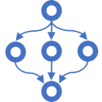

# Structured Concurrency [](https://github.com/StephenCleary/StructuredConcurrency/actions?query=workflow%3ABuild) [](https://codecov.io/gh/StephenCleary/StructuredConcurrency) [](https://www.nuget.org/packages/Nito.StructuredConcurrency)
Structured Concurrency for C#.

## Task Groups

A task group provides a scope in which work is done.
At the end of that scope, the task group (asynchronously) waits for all of its work to complete.

```C#
var groupTask = TaskGroup.RunGroupAsync(default, group =>
{
    group.Run(async token => await Task.Delay(TimeSpan.FromSeconds(1), token));
    group.Run(async token => await Task.Delay(TimeSpan.FromSeconds(2), token));
});
await groupTask; // Completes after 2 seconds.
```

A `TaskGroup` is started with `TaskGroup.RunGroupAsync`.
The delegate passed to `RunGroupAsync` is the first work item; it can do its own work and/or add other work items to that same group.
When all the work items have completed, then the group scope closes, and the task returned from `RunGroupAsync` completes.

Work may be added to a task group at any time by calling `Run`, as long as the scope has not completed.
Conceptually, the task group scope ends with a kind of `Task.WhenAll`, but with the important difference that more work may be added after the disposal begins.
As long as the work is added before all other work completes, the task group will "extend" its logical `WhenAll` to include the additional work.

```C#
var groupTask = TaskGroup.RunGroupAsync(default, group =>
{
    // Any group work can kick off other group work.
    group.Run(async token =>
    {
        for (int i = 0; i != 3; ++i)
        {
            await Task.Delay(TimeSpan.FromSeconds(1), token));
            group.Run(async token => await Task.Delay(TimeSpan.FromSeconds(1), token));
        }
    });
});
await groupTask; // Completes after 4 seconds.
```

### Exceptions

If any work throws an exception (except `OperationCanceledException`), then that work is considered "faulted".
The task group immediately enters a canceled state (see below), cancelling all of its other work that are sharing
the same `CancellationToken`.

```C#
var groupTask = TaskGroup.RunGroupAsync(default, group =>
{
    group.Run(async token =>
    {
        await Task.Delay(TimeSpan.FromSeconds(1), token);
        throw new Exception("oops");
    });

    // This task would normally take 2 seconds, but is canceled after 1 second.
    group.Run(async token => await Task.Delay(TimeSpan.FromSeconds(2), token));
});
await groupTask; // Completes after 1 second and raises Exception("oops").
```

At the end of the task group scope, the task group will still wait for all of its work to complete that do not 
share the same `CancellationToken`.
Once all of the work has completed, then the task group task will re-raise the first exception from its faulted work.

```C#
var groupTask = TaskGroup.RunGroupAsync(default, group =>
{
    group.Run(async token =>
    {
        await Task.Delay(TimeSpan.FromSeconds(1), token);
        throw new Exception("oops");
    });

    // This task takes 2 seconds since it ignores cancellation.
    group.Run(async _ => await Task.Delay(TimeSpan.FromSeconds(2)));
});
await groupTask; // Completes after 2 seconds and raises Exception("oops").
```

### Cancellation

Task groups always ignore any work that is cancelled (i.e., task groups catch and ignore `OperationCanceledException`).
Task groups provide `CancellationToken` parameters to all of their work, and it is the work's responsibility to respond to that cancellation.
The task group will cancel itself if any work item faults (with an exception other than `OperationCanceledException`).

Task groups also take a `CancellationToken` as parameter to the static `RunGroupAsync` methods to enable cancellation from "upstream"; e.g., if the application is shutting down.
Task groups can also be cancelled manually (via `TaskGroup.CancellationTokenSource`) if the program logic wishes to stop the task group for any reason.

```C#
var groupTask = TaskGroup.RunGroupAsync(default, group =>
{
    // Apply a timeout for all work sent to this group.
    group.CancellationTokenSource.CancelAfter(TimeSpan.FromSeconds(2));

    group.Run(async token => await Task.Delay(TimeSpan.FromSeconds(1), token));
    group.Run(async token => await Task.Delay(Timeout.InfiniteTimeSpan, token));
});
await groupTask; // Completes after 2 seconds.
```

### Resources

A task group can own resources.
These resources will be disposed by the task group after all its work is done.

```C#
var groupTask = TaskGroup.RunGroupAsync(default, async group =>
{
    await group.AddResourceAsync(myDisposableResource);

    group.Run(async token => await myDisposableResource.DoWorkAsync(token));
});
await groupTask; // First, waits for all tasks to complete; then, disposes myDisposableResource.
```

All exceptions raised by disposal of any resource are ignored.

### Races

The usual pattern for task groups is to cancel on failure and ignore success.
Sometimes, we want to "race" several work items to produce a result; in this case, we want the opposite: ignore failures and cancel on success.

The usual pattern is to create a race child group via `TaskGroup.RaceGroupAsync`.
This creates a separate group along with a race result that are used for races.
To race work, call `Race` instead of `Run`.
The first successful `Race` will cancel all the others.
Once all races have completed (i.e., the race child group's scope is complete), then the results of the race are returned from `RaceGroupAsync`.

```C#
var groupTask = TaskGroup.RaceGroupAsync<int>(default, group =>
{
    group.Race(async token => { await Task.Delay(TimeSpan.FromSeconds(1), token); return 1; });
    group.Race(async token => { await Task.Delay(TimeSpan.FromSeconds(2), token); return 2; });
    group.Race(async token => { await Task.Delay(TimeSpan.FromSeconds(3), token); return 3; });
});
var result = await groupTask; // Returns `1` after 1 second.
```

Successful results that lose the race are treated as resources, but are disposed immediately rather than scoped to the race child group.
